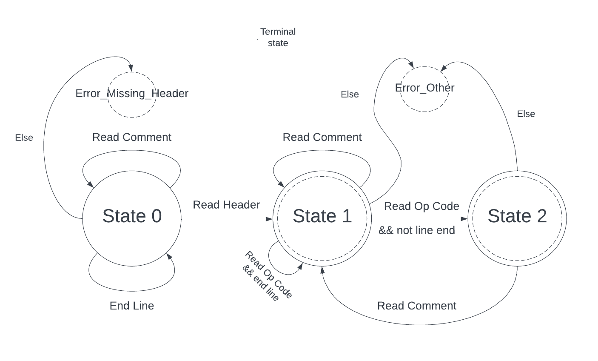

### Implementační dokumentace k 1 úloze do IPP 2023/2024
### Jméno a příjmení: Kirill Kurakov
### Login: xkurak03

The whole solution fits into a single script file. There was no reason to complicate it and create more. The project is object-oriented and there are some reasons for this. First, there is a class that named **Parser**. Parser has 1 instance and the content of this class has everything needed for parsing IPPcode24. This class in theory can support parsing not only one language IPPcode24, but very similar unstructured imperative languages that include three-address and possibly stack instructions. You can load a list of these instructions into a class when you create it. Or, for example, you could parse just one specific code line if you specify this in `__init__`. 

In the beggining of the program, Parser methods read line in method `get_next_line`, then method `parse_line` choose what every line beginning can be (сomment, instruction, header) by Finite State Machine. Machine's scheme is shown below.

 

In *State 0* program try to read header or comment. it is not possible to read operation code without reading a header. If the machine state changes to *State 1* and parser control an operation code thanks to the regular expression library, the `parse_instr` method launches. Here the parser searches for matches with the instructions we gave during initialization. If everything is alright and Parser found instruction, then method `parse_instr_args` tests the validity of function arguments via regular expressions library. 

At the same time an instance of the class **ProcessedInstrunction** is created in `parse_instr_args`. The number of instructions in the code is equal to the number of instances of the class. All attributes and methods from this class help to process the instruction and then represent it like a branch in the XML tree. When calling a method `create_instr_branch`, program create a branch based on the XML tree in **Parser** and then put instructon and arguments into this branch `arg_set` in the correct order. Parser call this method `arg_set` in `parse_instr_args` and in special cases `parse_const` when we meet constants.

Program goes to *State 2* if if the instructions is read and source code line doesn't end. Here it expect comment after all instruction arguments. 

States *State 1* and *State 2* might be terminal states. Program repeat reading line until the input IPPcode24 code runs out and then print Xml tree to stdout.