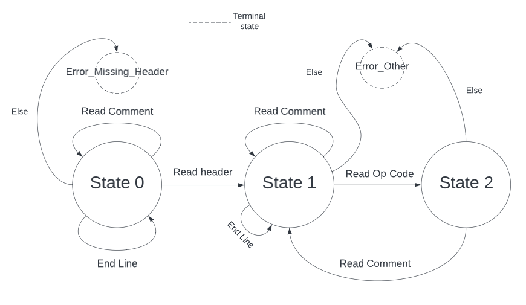

### Implementační dokumentace k 1 úloze do IPP 2023/2024
### Jméno a příjmení: Kirill Kurakov
### Login: xkurak03

The whole solution fits into a single script file. There was no reason to complicate it. The project is object-oriented and there are some reasons for this. First, there is a class that named **Parser**. Parser has 1 instance and the content of this class has everything needed for parsing IPPcode24. This class in theory can support parsing not only one language IPPcode24, but very similar unstructured imperative languages that include three-address and possibly stack instructions. You can load a list of these instructions into a class when you create it. Or, for example, you could parse just one specific code line if you specify this in `__init__`. 

In the beggining, Parser methods read line in method `get_next_line`, then method `parse_line` choose what every word on the line can be by Finite State Machine a schematic of which is shown below.

If the state of the machine changes to read an instruction, the `parse_instr` method is run. Here the parser searches for matches with the instructions we gave it during initialization. If everything alright and Parser found instruction, then method `parse_instr_args` tests the validity of function arguments via regular expressions library. 

At the same time an instance of the class **ProcessedInstrunction** is created in `parse_instr_args`. The number of instructions in the code is equal to the number of instances of the class. It is very convenient to represent an instruction as a class. Methods of this class create branches of xml tree `createXMLtree`and then place the input instructon and arguments into xml tree `arg_set` in the correct order. Parser call this methods in `parse_instr_args` and in special cases `parse_const`

Program repeat reading line until the input IPPcode24 code runs out and then print Xml tree to stdout.